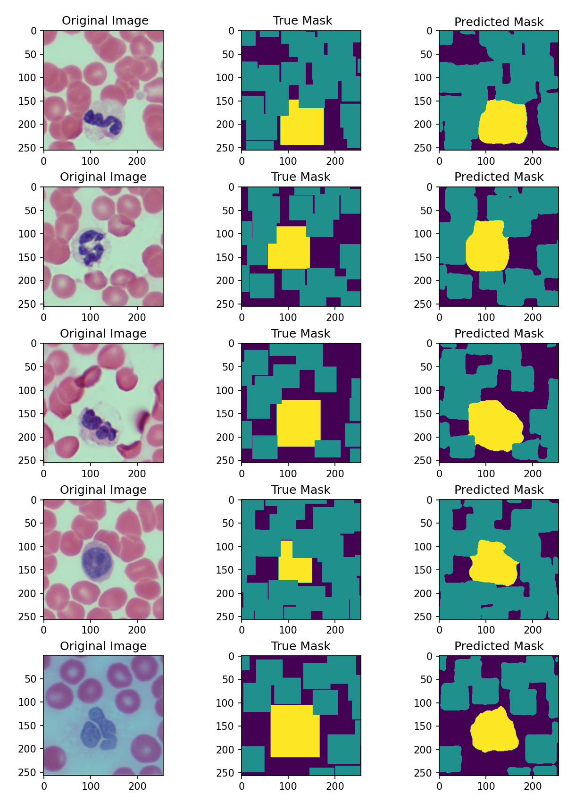

# Cell Segmentation Project using UNet

## Overview 📖

The Cell Segmentation Project utilizes the UNet architecture to identify and segment red blood cells (RBCs) and white blood cells (WBCs) in microscope images. This project demonstrates the application of deep learning, specifically convolutional neural networks, in medical image analysis, and is instrumental in medical diagnoses and research.

## Dataset 📊

This project uses the [Blood Cell Detection Dataset](https://www.kaggle.com/datasets/draaslan/blood-cell-detection-dataset/data) from Kaggle, which includes a collection of microscope images of blood cells. The dataset provides a foundation for training the model to segment and identify different types of blood cells.

## Installation 💻

To run this project, you'll need Python and TensorFlow installed on your machine.

- **Python**: Ensure Python is installed. [Download Python](https://www.python.org/downloads/).
- **TensorFlow**: Install TensorFlow for Python using pip:

```
pip install tensorflow
```

## Usage 🛠️

To use this project, follow these steps:

1. **Prepare Your Dataset**:
 - Place your microscope images from the Kaggle dataset in the `resources/images` directory. 
 - Ensure that you have an `annotations.csv` file detailing the cell locations and labels, as provided in the dataset.

2. **Update File Paths**:
 - In the `data.py` script, update the `base_path` to your image directory if different from the default.
 - Update the path in `load_annotations` in `train.py` to your annotations file.

3. **Run the Training Script**:
 - Execute the `train.py` script to train the model. This script will automatically split the data, train the UNet model, and save the best model.
 - Optionally, adjust the `epochs` and `batch_size` in the training script as needed.

4. **Visualize the Results**:
 - After training, the script will visualize some of the segmented images showing the original, the true mask, and the predicted mask.

## Project Structure 📁

- **data.py**: Contains functions for loading and preprocessing data.
- **model.py**: Defines the UNet architecture.
- **train.py**: Handles the training, evaluation, and visualization of the model.
- **resources/images/**: Directory containing your microscope images.
- **resources/annotations.csv**: Annotations file detailing cell locations and labels.

## Understanding UNet Architecture 🔬

### Concept of UNet


UNet is a type of convolutional neural network (CNN) developed primarily for biomedical image segmentation. Named 'UNet' due to its U-shaped structure, it was introduced by Olaf Ronneberger, Philipp Fischer, and Thomas Brox in their paper "U-Net: Convolutional Networks for Biomedical Image Segmentation."

### Deep dive in UNet
#### Contracting Path (Downsampling)
1. Initial Convolution Blocks:

- Each block consists of two 3x3 convolutions, each followed by a rectified linear unit (ReLU).
- The first layer starts with a relatively small number of feature channels (e.g., 64), which is doubled with each subsequent downsampling step.
- These convolutional layers extract features from the image at various levels of abstraction.

2. Max Pooling:

- After each convolution block, a 2x2 max pooling layer with stride 2 reduces the spatial dimensions of the feature maps.
- This downsampling process increases the receptive field, allowing the network to capture more global information from the input image.

3. Feature Channel Doubling:

- As the network goes deeper, the number of feature channels doubles. This increment allows the network to learn more complex features at each level.
- For instance, if the first layer has 64 channels, the next layer after pooling would have 128, and so on.
  
#### Bottleneck
1. Transition between Downsampling and Upsampling:
- The bottleneck is the part of the network with the smallest spatial dimensions.
- It typically includes two 3x3 convolutions with ReLU activations and possibly a dropout layer.
- This section processes the most abstract representations of the input data.


#### Expanding Path (Upsampling)

1. Upsampling:

- The network symmetrically expands, starting from the bottleneck.
- Upsampling (or up-convolution) is used to increase the spatial dimensions of the feature maps.
- The number of feature channels is halved with each upsampling step.

2. Concatenation with Corresponding Feature Maps:

- After upsampling, the feature map is concatenated with the feature map from the corresponding level of the contracting path.
- These skip connections provide high-resolution features to the expanding path, which helps in precise localization.

3. Convolution Blocks after Concatenation:

- Following each concatenation, there are two 3x3 convolutions, each followed by ReLU.
- These convolutions process the combined features from both the contracting path and the upsampling path.

#### Output Layer
1. 1x1 Convolution:
- The final layer of the network is a 1x1 convolution.
- This layer is used to map the feature vectors to the desired number of classes for segmentation.
- For binary segmentation, it typically has a single output channel. For multi-class segmentation, the number of output channels corresponds to the number of classes.

### Key Features of UNet

1. **Symmetrical Design**: UNet's architecture consists of a contracting path and an expansive path, forming a U-shaped design. This structure captures context and enables precise localization.

2. **Contracting Path**: Involves repeated application of convolutions, ReLU activations, and max pooling for downsampling, increasing feature channels at each step.

3. **Expansive Path**: Includes upsampling, "up-convolutions," and concatenation with features from the contracting path, followed by convolutions and ReLU activations.

4. **Skip Connections**: Connect contracting path layers to expansive path layers, propagating context information to higher resolution layers.

5. **Final Layer**: A 1x1 convolution maps each feature vector to the desired number of classes.

### Applications

UNet is widely used in biomedical image segmentation, such as segmenting cells or tissues in microscopy images, due to its precision and efficiency, especially in scenarios with limited high-quality data.

## Results 📸

Below are some examples of the cell segmentation results. These images showcase the model's ability to accurately segment RBCs and WBCs in microscope images from the Kaggle dataset.




## Notes 📝

- This project is specifically designed for segmenting RBCs and WBCs in microscope images. Adjustments may be needed for different types of cells or imaging modalities.
- Performance and accuracy can vary based on image quality and characteristics.

